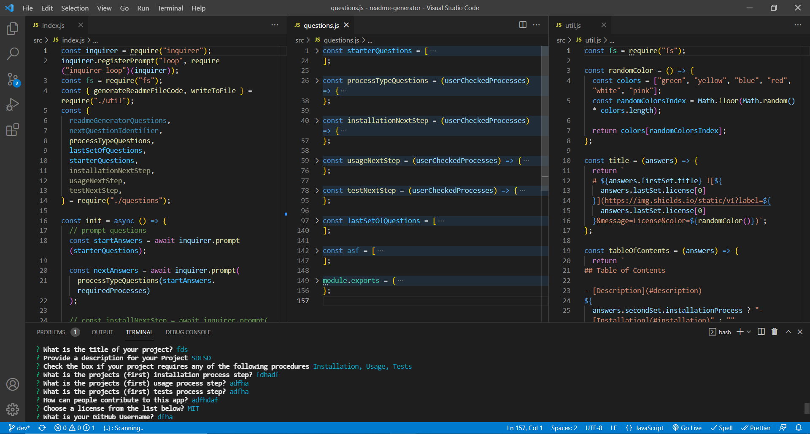

# ReadMe-generator

## Description:

This command line application allows the user to dynamically create a REAME.md file by simply answering the questions that are presented with in the command line.

## Acceptance Criteria:

```
GIVEN a command-line application that accepts user input
WHEN I am prompted for information about my application repository
THEN a high-quality, professional README.md is generated with the title of my project and sections entitled Description, Table of Contents, Installation, Usage, License, Contributing, Tests, and Questions
WHEN I enter my project title
THEN this is displayed as the title of the README
WHEN I enter a description, installation instructions, usage information, contribution guidelines, and test instructions
THEN this information is added to the sections of the README entitled Description, Installation, Usage, Contributing, and Tests
WHEN I choose a license for my application from a list of options
THEN a badge for that license is added near the top of the README and a notice is added to the section of the README entitled License that explains which license the application is covered under
WHEN I enter my GitHub username
THEN this is added to the section of the README entitled Questions, with a link to my GitHub profile
WHEN I enter my email address
THEN this is added to the section of the README entitled Questions, with instructions on how to reach me with additional questions
WHEN I click on the links in the Table of Contents
THEN I am taken to the corresponding section of the README
```

## Video :

To see how the application works <a href=https://dmo17.github.io/weather-dashboard/>click here </a>

## Preview: Image of the Code:



## Installation

Run the following script to install the packages required for the application:

```
npm install inquirer

npm install inquirer-loop

```

## Scripts

Ensure that the package.json file has the following script:

```
 "start": "node src/index.js"

```

## Usage

To use the application run the following script:

```
npm run start
```

## Tools Used

- node.js
- inquirer - npm
- Languages:
- JavaScript
- JQuery
